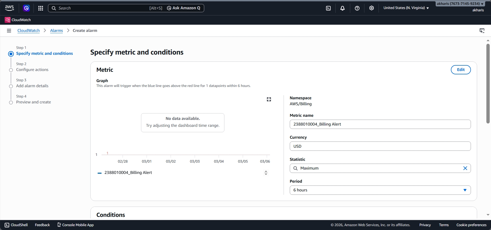
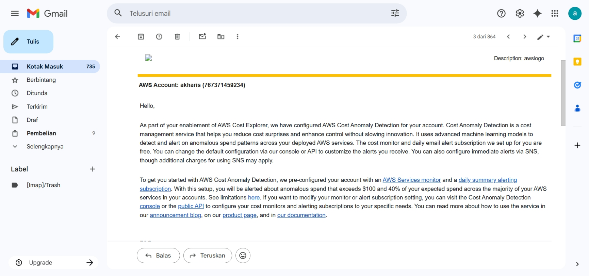

# Praktikum 2: Billing Alert — Monitoring Biaya AWS

**Administrasi Server - Pertemuan 2**

---

## 🎯 Tujuan Praktikum

Setelah mengikuti praktikum ini, kamu akan:

- Memahami pentingnya monitoring biaya di AWS
- Mampu membuat alarm notifikasi saat biaya mendekati batas
- Mengerti cara kerja CloudWatch dan SNS untuk billing alert

---

## 📋 Langkah Kerja

### 1. Aktifkan Billing Preferences

> ⚠️ **Penting:** Langkah ini wajib dilakukan pertama kali. Tanpa ini, AWS tidak akan mengirim notifikasi billing.

1. Login ke **AWS Management Console**
2. Cari **"Billing"** di kolom pencarian
3. Klik **Billing and Cost Management**
4. Di menu kiri, pilih **Alert Preferences**
5. Klik **Edit**
6. Isi data berikut:

| Field                          | Isi                   |
| ------------------------------ | --------------------- |
| Email                          | Email aktif kamu      |
| Receive Billing Alerts         | ✅ Centang            |
| Receive Free Tier Usage Alerts | ✅ Centang (opsional) |

7. Klik **Update**

---

### 2. Pindah Region ke US East (N. Virginia)

> 🚨 **PENTING:** Metrik billing hanya tersedia di region ini!

1. Klik dropdown region di pojok kanan atas
2. Pilih **US East (N. Virginia)** atau `us-east-1`

---

### 3. Buka CloudWatch

1. Cari **"CloudWatch"** di kolom pencarian
2. Klik layanan tersebut
3. Di menu kiri, klik **Alarms** → **Create alarm**

---

### 4. Pilih Metrik Billing

1. Klik **Select metric**
2. Pilih **Billing** → **Total Estimated Charge**
3. Centang **USD**
4. Klik **Select metric**

---

### 5. Tentukan Threshold (Ambang Batas)

Konfigurasi kondisi alarm:

| Setting         | Nilai                               |
| --------------- | ----------------------------------- |
| Type            | Static                              |
| Whenever... is  | Greater (>)                         |
| Threshold value | `1` (atau sesuai instruksi dosen) |

> 💡 **Tips:** Threshold $1 berarti kamu akan dapat notifikasi saat biaya melebihi $1 (sekitar Rp 15.000).

---

### 6. Konfigurasi Notifikasi (SNS)

1. Pilih **Create new topic**
2. Nama topic: `NIM_BillingAlert` (contoh: `2388010004_BillingAlert`)
3. Email: masukkan email yang sama seperti di Billing Preferences
4. Klik **Create topic**

---

### 7. Finalisasi Alarm

1. Klik **Next**
2. Alarm name: `NIM_BillingAlert`
3. Review konfigurasi
4. Klik **Create alarm**

---

### 8. Konfirmasi Subscription (WAJIB!)

> ⚠️ **Langkah ini sering dilewatkan!** Alarm tidak akan mengirim email sebelum dikonfirmasi.

1. Buka **inbox email** yang didaftarkan
2. Cari email dari **AWS Notifications**
3. Subjek: *AWS Notification - Subscription Confirmation*
4. Buka email dan klik **Confirm subscription**

> 📌 **Cek folder spam** jika email tidak muncul di inbox!

---

### 9. Verifikasi Status Alarm

1. Kembali ke **CloudWatch Console**
2. Buka **Alarms** → **All alarms**
3. Cari alarm `NIM_BillingAlert`
4. Cek status:

| Status   | Arti                                  |
| -------- | ------------------------------------- |
| OK       | Alarm aktif, biaya di bawah threshold |
| In Alarm | Biaya sudah melebihi threshold        |
| Pending  | Menunggu konfirmasi email             |

---

## 📝 Checklist Hasil Praktikum

- [X] Billing Preferences sudah diaktifkan
- [X] CloudWatch alarm berhasil dibuat
- [X] SNS topic sudah dibuat dengan nama sesuai format
- [X] Email subscription sudah dikonfirmasi
- [X] Status alarm = OK (atau Insufficient Data)

---

## ❓ FAQ

**Q: Kenapa harus region US East (N. Virginia)?**
A: AWS menyimpan data billing global di region tersebut. Metrik billing tidak tersedia di region lain.

**Q: Berapa threshold yang disarankan?**
A: Untuk pembelajaran, $1 cukup untuk early warning. Bisa disesuaikan dengan budget masing-masing.

**Q: Kenapa email tidak diterima?**
A: Cek folder spam. Pastikan email yang dimasukkan benar dan aktif.

**Q: Kapan alarm akan trigger?**
A: Data billing update setiap 24 jam. Alarm tidak real-time.

---

*Dokumentasi praktikum Administrasi Server Semester 6*
