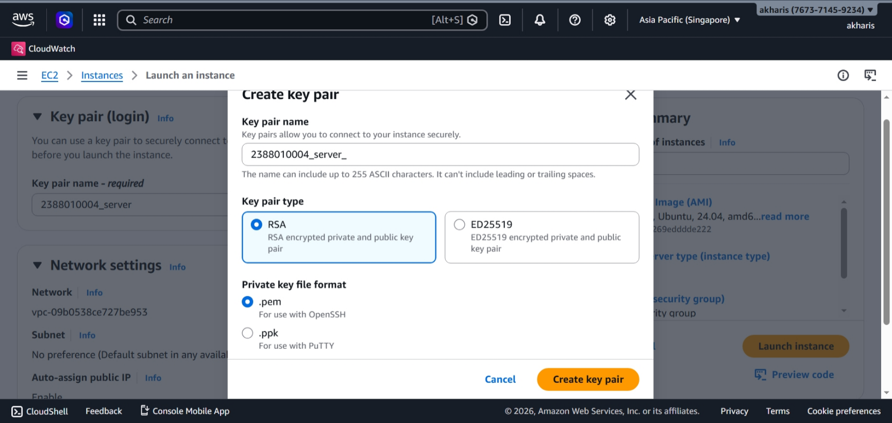
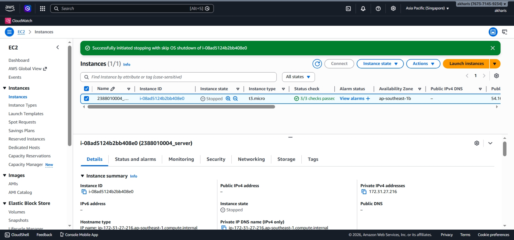

# Praktikum 2: Membuat EC2 Instance

**Administrasi Server - Pertemuan 2**

---

## 🎯 Tujuan Praktikum

Setelah mengikuti praktikum ini, kamu akan:
- Memahami cara membuat virtual server (EC2) di AWS
- Mengerti konfigurasi dasar yang diperlukan untuk instance
- Mampu menyiapkan server untuk keperluan praktikum selanjutnya

---

## 📋 Langkah Kerja

### 1. Buka EC2 Dashboard

1. Login ke **AWS Management Console**
2. Ketik **"EC2"** di kolom pencarian
3. Klik layanan **EC2**
4. Klik tombol **Launch Instance**

---

### 2. Pilih Region

> ⚠️ **Penting:** Pastikan region yang dipilih sesuai dengan yang diinstruksikan dosen.

Klik dropdown region di pojok kanan atas dan pilih region terdekat (disarankan **Singapore / ap-southeast-1**).

---

### 3. Konfigurasi Instance

#### a. Nama Instance
- Isi nama dengan format: **`NIM_Server6A`**
- Contoh: `2388010004_Server6A`

#### b. Application and OS Images (AMI)
- Pilih **Ubuntu Server 22.04 LTS**
- Pastikan ada label **Free Tier eligible**

#### c. Instance Type
- Pilih **t3.micro**
- Ini adalah tipe instance yang termasuk dalam Free Tier AWS

---

### 4. Key Pair (Kunci Akses)

> 🔑 **Catatan:** File ini adalah satu-satunya cara untuk login ke server. Simpan baik-baik!

1. Klik **Create new key pair**
2. Nama: `Key_Server_6A`
3. Format: **.pem** (untuk Mac/Linux) atau **.ppk** (untuk PuTTY di Windows)
4. Klik **Create**
5. File akan otomatis terunduh — **simpan di tempat aman**

---

### 5. Network Settings (Firewall)

Di bagian ini, centang opsi berikut:

- [x] **Allow SSH traffic** (Port 22) — untuk akses remote
- [x] **Allow HTTPS traffic** (Port 443) — untuk web aman
- [x] **Allow HTTP traffic** (Port 80) — untuk web standar

---

### 6. Storage

- Ubah kapasitas menjadi **30 GiB**
- Ini adalah batas maksimal Free Tier agar tidak kena biaya tambahan

---

### 7. Launch Instance

1. Review semua konfigurasi di panel kanan
2. Klik **Launch instance**
3. Tunggu hingga muncul notifikasi sukses
4. Klik **View all instances**

---

### 8. Verifikasi

Pastikan instance yang baru dibuat memiliki:

| Item | Status |
|------|--------|
| Name | `NIM_Server6A` |
| Instance state | ✅ running (hijau) |
| Status check | 2/2 checks passed |

**Catat Public IPv4 Address** — kamu akan butuh ini untuk akses SSH di praktikum berikutnya.

---

## 📝 Checklist Hasil Praktikum

- [ ] Instance berhasil dibuat dengan nama sesuai format
- [ ] Key pair tersimpan dengan aman
- [ ] Security Group sudah membuka port SSH, HTTP, HTTPS
- [ ] Storage 30 GiB (Free Tier)
- [ ] Status instance running dan healthy

---

## ❓ FAQ

**Q: Kenapa harus region Singapore?**  
A: Region terdekat memberikan latency lebih rendah. Tapi ikuti instruksi dosen jika berbeda.

**Q: Apa yang terjadi jika key pair hilang?**  
A: Kamu tidak bisa login ke server. Harus buat instance baru dengan key pair baru.

**Q: Berapa biaya instance t3.micro?**  
A: Termasuk Free Tier — gratis 750 jam/bulan selama 12 bulan pertama.

---

*Dokumentasi praktikum Administrasi Server Semester 6*
