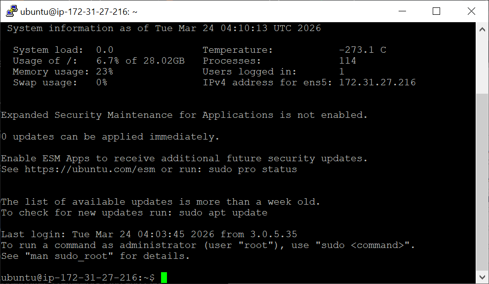
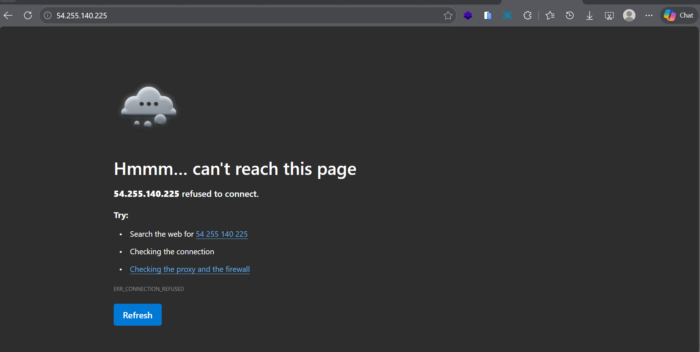
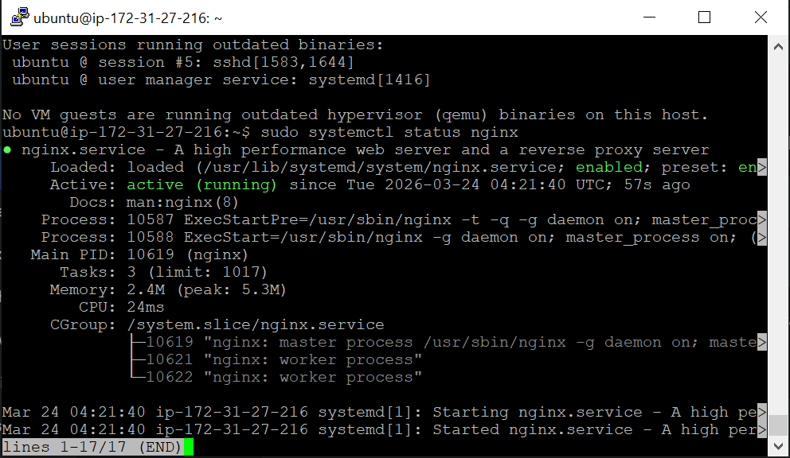
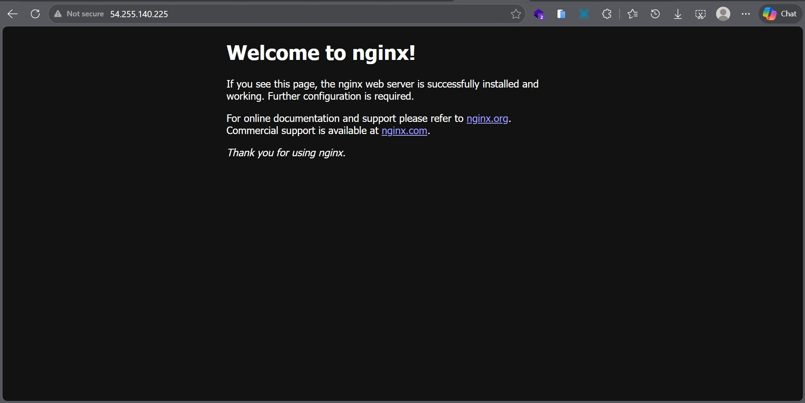

# Praktikum 3: Remote SSH dan Instalasi Web Server

**Administrasi Server - Pertemuan 3**

---

## 🎯 Tujuan Praktikum

Setelah mengikuti praktikum ini, kamu akan:
- Mampu melakukan remote connection ke EC2 instance via SSH
- Memahami cara kerja key pair authentication
- Mampu melakukan patching OS server
- Mampu instal dan konfigurasi web server (Nginx)

---

## 📋 Langkah Kerja

### 1. Install PuTTY (Windows)

> 💡 **Catatan:** Pengguna Mac/Linux bisa langsung pakai terminal dengan command `ssh`

1. Download PuTTY dari:
   ```
   https://www.chiark.greenend.org.uk/~sgtatham/putty/latest.html
   ```
2. Install dengan konfigurasi default
3. Aplikasi yang terinstall:
   - **PuTTY** — untuk SSH connection
   - **PuTTYgen** — untuk konversi key pair



---

### 2. Konversi Key Pair (.pem → .ppk)

> 🔑 **Kenapa harus dikonversi?**  
> File `.pem` dari AWS format untuk Linux/Mac. PuTTY di Windows butuh format `.ppk`.

1. Buka **PuTTYgen**
2. Klik **Load**
3. Ubah filter jadi **All Files (*.*)**
4. Pilih file `.pem` yang didownload saat buat EC2
5. Klik **Save private key**
6. Simpan sebagai `.ppk` (contoh: `Key_Server_6A.ppk`)


---

### 3. Setup Koneksi SSH di PuTTY

1. Buka **PuTTY**
2. Konfigurasi berikut:

| Field | Isi |
|-------|-----|
| Host Name (or IP address) | Public IPv4 Address dari EC2 instance |
| Port | `22` |
| Connection type | SSH |

3. Load private key:
   - Navigasi ke: **Connection** → **SSH** → **Auth** → **Credentials**
   - Browse file `.ppk` yang sudah dibuat

4. (Opsional) Save session:
   - Kembali ke **Session**
   - Isi **Saved Sessions**, klik **Save**

5. Klik **Open**


---

### 4. Login ke Server

1. Saat terminal terbuka, masukkan username:
   ```
   login as: ubuntu
   ```

> ⚠️ **Username tergantung OS:**
> - Ubuntu → `ubuntu`
> - Amazon Linux → `ec2-user`
> - CentOS → `centos`

2. Jika berhasil, akan muncul prompt server:
   ```
   ubuntu@ip-172-31-16-123:~$
   ```

---

### 5. Patching OS (Wajib!)

> 💡 **Kenapa patching?**  
> Server yang baru dibuat perlu diupdate untuk keamanan dan stabilitas.

Jalankan command berikut:

```bash
sudo apt-get update && sudo apt-get upgrade
```

| Command | Fungsi |
|---------|--------|
| `sudo apt-get update` | Update daftar paket dari repository |
| `sudo apt-get upgrade` | Install versi terbaru paket yang ada |

Proses ini bisa memakan waktu 2-10 menit.

---

### 6. Instalasi Web Server (Nginx)

Setelah OS updated, instal web server:

```bash
sudo apt install nginx
```

Tunggu hingga instalasi selesai.


---

### 7. Verifikasi Nginx

1. Cek status service:
   ```bash
   systemctl status nginx
   ```

2. Pastikan statusnya **active (running)**



---

### 8. Test Web Server

1. Buka browser
2. Akses: `http://<Public_IP_Address>`
3. Jika berhasil, akan muncul halaman **Welcome to nginx!**




---

## 📝 Checklist Hasil Praktikum

- [ ] PuTTY terinstall dan berfungsi
- [ ] Key pair berhasil dikonversi ke .ppk
- [ ] Berhasil login ke server via SSH
- [ ] OS sudah diupdate (patching selesai)
- [ ] Nginx terinstall dan status active (running)
- [ ] Web server bisa diakses via browser

---

## ❓ FAQ

**Q: Kenapa tidak bisa connect via SSH?**  
A: Cek Security Group di EC2 — pastikan port 22 (SSH) sudah dibuka.

**Q: "Server refused our key" — apa artinya?**  
A: Key pair yang digunakan salah atau tidak cocok. Pastikan load file .ppk yang benar.

**Q: Kenapa harus patching setiap kali remote?**  
A: Best practice keamanan server. OS yang baru dibuat mungkin punya vulnerability yang sudah di-patch di versi terbaru.

**Q: Command untuk keluar dari SSH?**  
A: Ketik `exit` atau tekan `Ctrl+D`

---

## 🔗 Command Reference

```bash
# Update & upgrade OS
sudo apt-get update && sudo apt-get upgrade

# Cek status Nginx
systemctl status nginx

# Restart Nginx
sudo systemctl restart nginx

# Exit SSH
exit
```

---

*Dokumentasi praktikum Administrasi Server Semester 6*
