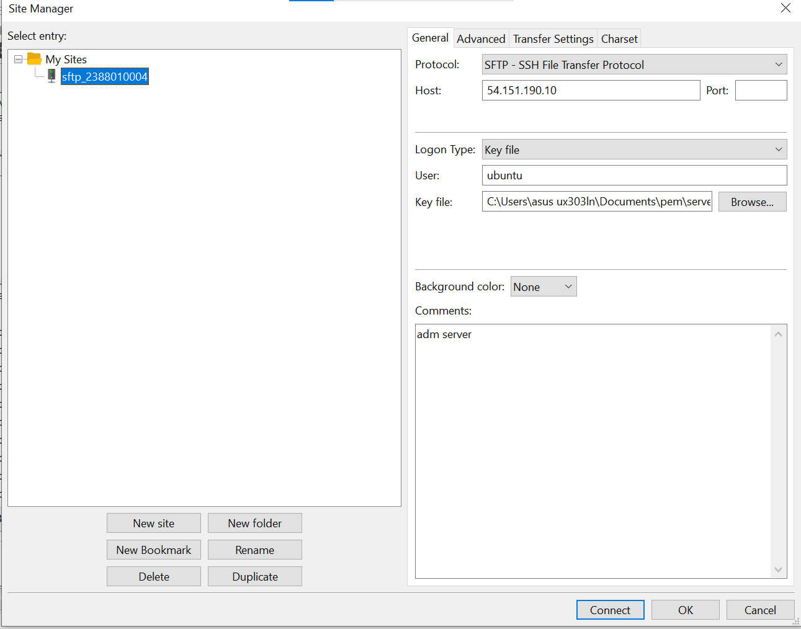
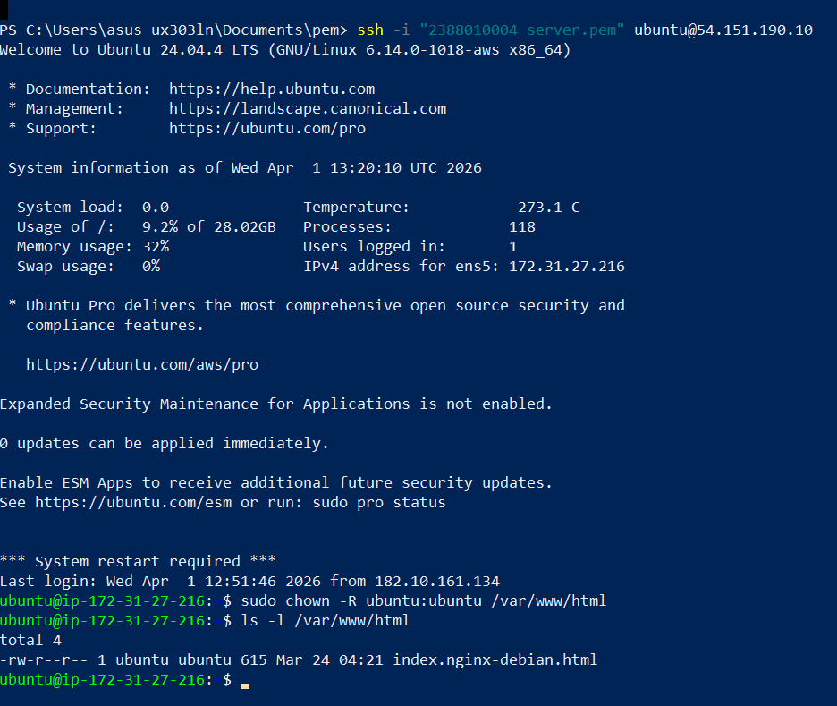
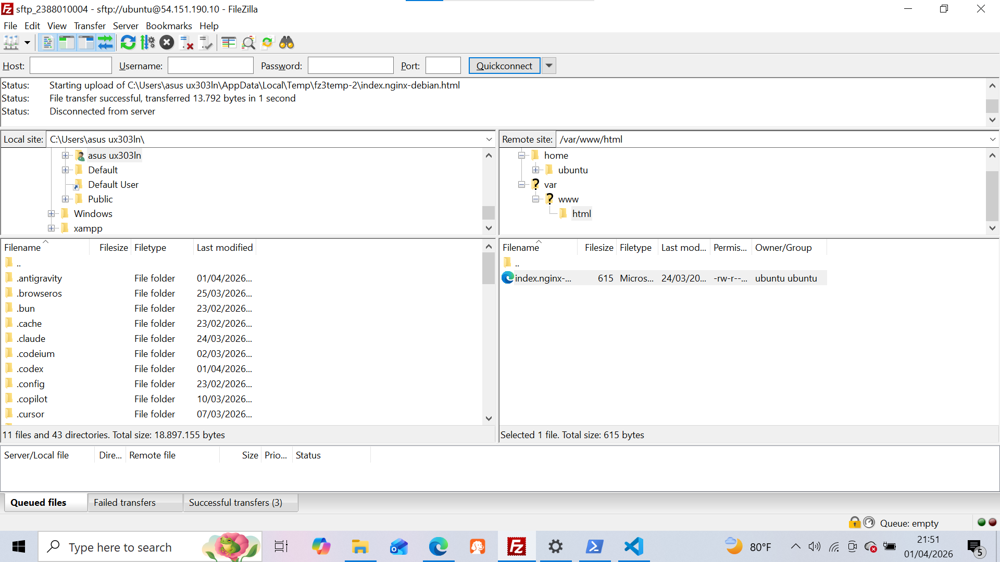

# Praktikum 4: Migrasi Data ke Cloud dengan SFTP dan Manajemen Hak Akses

**Administrasi Server - Pertemuan 4**

---

## 🎯 Tujuan Praktikum

Setelah mengikuti praktikum ini, kamu akan:
- Mampu melakukan transfer file dari lokal ke server EC2 menggunakan SFTP (FileZilla)
- Memahami konsep hak akses folder di Linux
- Mampu mengubah ownership folder web server untuk keperluan development
- Memahami alur kerja deployment file ke web server

---

## 📋 Langkah Kerja

### 1. Install FileZilla Client

FileZilla adalah aplikasi FTP/SFTP client untuk transfer file antara komputer lokal dan server.

1. Download FileZilla dari:
   ```
   https://filezilla-project.org/
   ```
2. Install dengan konfigurasi default

---

### 2. Start EC2 Instance

Pastikan instance EC2 kamu sudah running sebelum melakukan koneksi.

1. Buka **EC2 Dashboard** di AWS Console
2. Pilih instance kamu
3. Klik **Instance state** → **Start instance**
4. Tunggu hingga status = `running`

---

### 3. Koneksi SFTP dengan FileZilla

1. Buka **FileZilla**
2. Isi data koneksi berikut:

| Field | Isi |
|-------|-----|
| **Host** | `sftp://[IP_ADDRESS]` (ganti dengan Public IP instance) |
| **Username** | `ubuntu` |
| **Password** | (kosongkan jika pakai key pair, atau isi jika ada password) |
| **Port** | `22` |

3. Klik **Quickconnect**

> 💡 **Catatan:** Jika menggunakan key pair, FileZilla akan meminta lokasi file `.ppk` saat pertama kali koneksi.



---

### 4. Alternatif: Remote SSH via PowerShell

Jika ingin akses SSH langsung dari Windows:

1. Buka **PowerShell**
2. Masuk ke folder penyimpanan private key:
   ```powershell
   cd D:\AWS-Keys
   ```
3. Jalankan SSH:
   ```powershell
   ssh -i nama_file-Private-Key.pem ubuntu@[IP_ADDRESS]
   ```

---

### 5. Navigasi ke Web Directory

Setelah terhubung (via FileZilla atau SSH), arahkan ke folder web server.

**Default location web server:**
```
/var/www/html
```

**Langkah:**
1. Keluar dari direkti `/home/ubuntu`:
   ```bash
   cd ..
   ```
2. Masuk ke direktori web:
   ```bash
   cd /var/www/html
   ```
3. Coba buka file `index.html` dengan editor

> ⚠️ **Problem:** Kamu akan mendapat error **Permission denied** saat mencoba edit.
>
> **Penyebab:** User `ubuntu` tidak memiliki hak akses write ke folder `/var/www/html`.

---

### 6. Ubah Hak Akses Folder (Ownership)

Untuk bisa edit file web, ubah ownership folder ke user `ubuntu`.

**Via SSH/PowerShell:**

1. Ubah ownership folder:
   ```bash
   sudo chown -R ubuntu:ubuntu /var/www/html
   ```

   | Command | Fungsi |
   |---------|--------|
   | `sudo` | Jalankan sebagai root |
   | `chown` | Change owner |
   | `-R` | Recursive (semua file & subfolder) |
   | `ubuntu:ubuntu` | User:Group pemilik baru |

2. Verifikasi hak akses:
   ```bash
   ls -l /var/www/html
   ```

   Output yang diharapkan:
   ```
   drwxr-xr-x 1 ubuntu ubuntu 4096 Mar 24 10:00 html
   ```




---

### 7. Edit File Website

Setelah hak akses diubah, kamu bisa edit file `index.html`:

**Via FileZilla:**
1. Navigate ke `/var/www/html`
2. Drag & drop file `index.html` ke komputer lokal
3. Edit dengan text editor (VS Code, Notepad++, dll)
4. Upload kembali ke server (drag ke panel kanan FileZilla)

**Via SSH (nano/vim):**
```bash
cd /var/www/html
nano index.html
```

---

### 8. Verifikasi Website

1. Buka browser
2. Akses: `http://[IP_ADDRESS]`
3. Pastikan tampilan website sudah sesuai dan **responsive**


---

## 📝 Checklist Hasil Praktikum

- [ ] FileZilla terinstall dan berfungsi
- [ ] EC2 instance running
- [ ] Berhasil koneksi SFTP ke server
- [ ] Paham cara akses SSH via PowerShell
- [ ] Ownership `/var/www/html` sudah diubah ke `ubuntu:ubuntu`
- [ ] Berhasil edit dan upload file `index.html`
- [ ] Website bisa diakses via browser dan responsive

---

## ❓ FAQ

**Q: Kenapa harus pakai `sudo` saat ubah ownership?**  
A: Folder `/var/www/html` dimiliki oleh root. Hanya root yang bisa mengubah ownership, makanya perlu `sudo`.

**Q: Apa bedanya FTP dengan SFTP?**  
A: SFTP (SSH File Transfer Protocol) lebih aman karena semua data terenkripsi. FTP mengirim data dalam plain text.

**Q: Kenapa Permission denied saat edit file?**  
A: User kamu tidak punya hak write. Solusi: ubah ownership dengan `chown` atau hak akses dengan `chmod`.

**Q: Apakah aman mengubah ownership ke ubuntu?**  
A: Untuk development/praktikum, aman. Untuk production, pertimbangkan security implications dan buat user/group khusus.

**Q: Bagaimana cara mengembalikan ownership ke root?**  
A: Jalankan: `sudo chown -R root:root /var/www/html`

---

## 🔗 Command Reference

```bash
# Ubah ownership folder
sudo chown -R ubuntu:ubuntu /var/www/html

# Cek hak akses file/folder
ls -l /var/www/html

# Edit file dengan nano
nano /var/www/html/index.html

# Restart Nginx (jika perlu)
sudo systemctl restart nginx

# Cek status Nginx
systemctl status nginx
```

---

*Dokumentasi praktikum Administrasi Server Semester 6*
