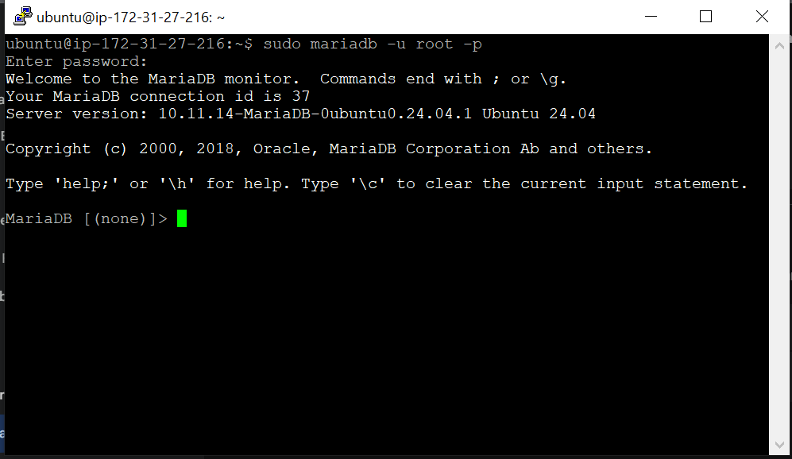
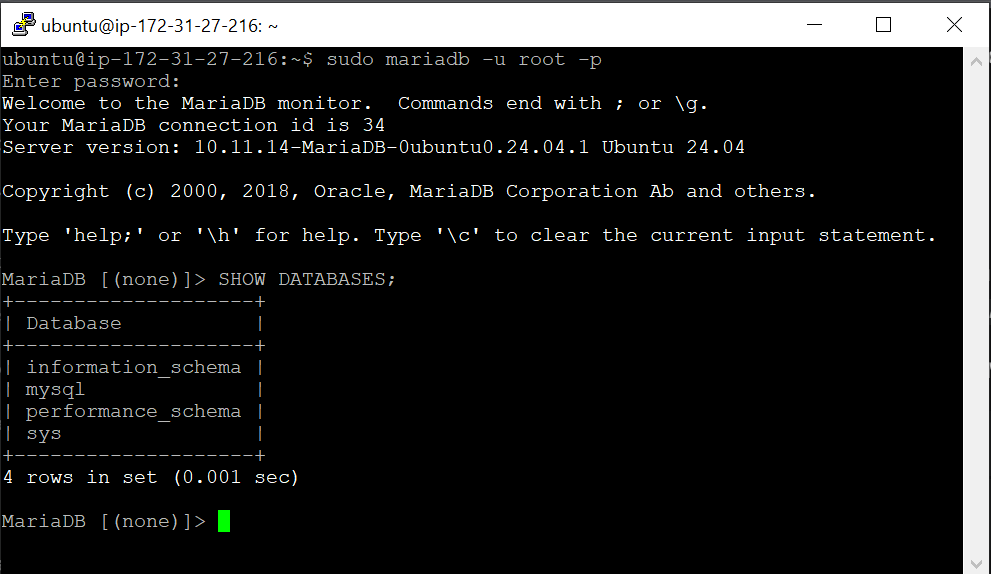
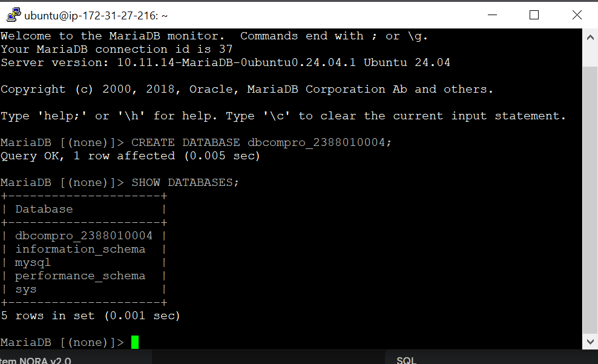
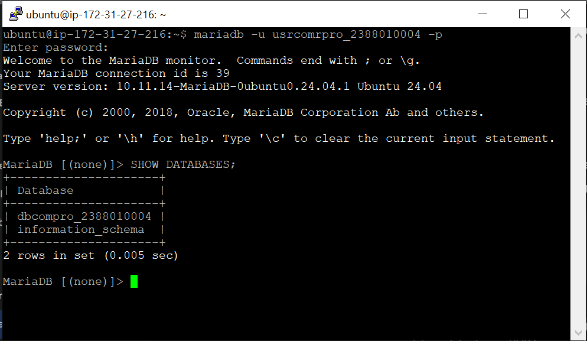

# Praktikum 5: Instalasi dan Konfigurasi Database Server (MariaDB)

**Administrasi Server - Pertemuan 5**

---

## 🎯 Tujuan Praktikum

Setelah mengikuti praktikum ini, kamu akan:

- Mampu menginstal dan konfigurasi MariaDB di server EC2
- Memahami pentingnya hardening database server
- Mampu membuat database, user, dan mengatur hak akses
- Memahami konsep privilege management di MySQL/MariaDB

---

## 📋 Langkah Kerja

### 1. Aktifkan EC2 Instance

Pastikan instance EC2 kamu sudah running sebelum melakukan koneksi.

1. Buka **EC2 Dashboard** di AWS Console
2. Pilih instance kamu
3. Klik **Instance state** → **Start instance**
4. Tunggu hingga status = `running`

---

### 2. Remote ke Server via SSH

Lakukan remote connection ke server menggunakan PowerShell atau PuTTY.

**Via PowerShell (OpenSSH):**

```powershell
ssh -i nama_file-Private-Key.pem ubuntu@[IP_ADDRESS]
```

**Via PuTTY:**

1. Buka PuTTY
2. Isi Host Name (Public IP), Port 22
3. Load private key `.ppk`
4. Klik **Open**

---

### 3. Patching OS (Wajib!)

> 💡 **Kenapa patching?**
> Server yang baru dibuat perlu diupdate untuk keamanan dan stabilitas sebelum instalasi software baru.

```bash
sudo apt-get update && sudo apt-get upgrade
```

Tunggu hingga proses selesai.

---

### 4. Instalasi MariaDB

**Apa itu MariaDB?**
MariaDB adalah fork dari MySQL yang open-source dan kompatibel penuh. Performa lebih baik dan fitur lebih lengkap dibanding MySQL standar.

```bash
sudo apt install mariadb-server -y
```

Tunggu hingga instalasi selesai.

---

### 5. Cek Status MariaDB

Setelah instalasi, pastikan service MariaDB berjalan dengan baik.

```bash
systemctl status mariadb
```

Output yang diharapkan:

```
● mariadb.service - MariaDB 10.6.19 database server
   Loaded: loaded (/lib/systemd/system/mariadb.service; enabled; preset: enabled)
   Active: active (running) since ...
```

> ✅ Pastikan statusnya **active (running)

---

### 6. Test Login Default

MariaDB baru diinstal masih pakai konfigurasi default. Kita coba login sebagai root.

```bash
sudo mysql -u root -p
```

- Jika diminta password, tekan **Enter** (default belum ada password)
- Jika berhasil, akan muncul prompt: `MariaDB [(none)]>`
- Ketik `exit;` untuk keluar

> ⚠️ **Masalah:** Defaultnya, root belum punya password dan bisa login tanpa autentikasi. Ini berbahaya untuk keamanan!
>
> 

---

### 7. Hardening Database Server (WAJIB!)

**Apa itu Hardening?**
Proses mengamankan database server dari konfigurasi default yang tidak aman.

```bash
sudo mysql_secure_installation
```

Kamu akan ditanya beberapa pertanyaan. Jawab dengan **Y** (Yes) untuk semua:

| Pertanyaan                                       | Jawaban | Keterangan                                 |
| ------------------------------------------------ | ------- | ------------------------------------------ |
| **Switch to unix_socket authentication?**  | Y       | Gunakan autentikasi socket yang lebih aman |
| **Change the root password?**              | Y       | Set password untuk user root               |
| **Remove anonymous users?**                | Y       | Hapus user tanpa nama (bahaya!)            |
| **Disallow root login remotely?**          | Y       | Root hanya boleh login dari localhost      |
| **Remove test database and access to it?** | Y       | Hapus database test yang tidak terpakai    |
| **Reload privilege tables now?**           | Y       | Muat ulang tabel hak akses                 |

> 🔐 **Penting:** Jangan skip langkah ini! Server database yang tidak di-hardening sangat rentan di-hack.

---

### 8. Membuat Database dan User untuk Website

Sekarang kita akan membuat database dan user khusus untuk website company profile.

#### a. Login sebagai Root

```bash
sudo mysql -u root -p
```

Masukkan password root yang sudah dibuat saat hardening.



---

#### b. Buat Database Baru

```sql
CREATE DATABASE dbcompro_NIM;
```

Ganti `NIM` dengan NIM kamu. Contoh: `dbcompro_2388010004`



---

#### c. Buat User Baru

```sql
CREATE USER 'usrcompro_NIM'@'localhost' IDENTIFIED BY '[PASSWORD]';
```

Ganti:

- `NIM` dengan NIM kamu
- `[PASSWORD]` dengan password yang kuat

Contoh:

```sql
CREATE USER 'usrcompro_2388010004'@'localhost' IDENTIFIED BY 'Password123!';
```

---

#### d. Berikan Hak Akses User ke Database

```sql
GRANT ALL PRIVILEGES ON dbcompro_NIM.* TO 'usrcompro_NIM'@'localhost';
```

Perintah ini memberikan hak penuh user `usrcompro_NIM` ke semua tabel di database `dbcompro_NIM`.

---

#### e. Muat Ulang Hak Akses

```sql
FLUSH PRIVILEGES;
```

Perintah ini memastikan perubahan hak akses langsung diterapkan.


---

#### f. Keluar dan Login sebagai User Baru

```sql
exit;
```

Sekarang login menggunakan user yang baru dibuat:

```bash
mysql -u usrcompro_NIM -p
```

Masukkan password yang sudah dibuat.

---

#### g. Verifikasi Akses Database

Setelah login sebagai user baru, cek database yang bisa diakses:SHOW DATABASES;

Pastikan `dbcompro_NIM` muncul di daftar.



---

## 📝 Checklist Hasil Praktikum

- [ ] EC2 instance running
- [ ] Berhasil remote via SSH
- [ ] OS sudah diupdate (patching)
- [ ] MariaDB terinstall dan status active (running)
- [ ] Hardening database selesai (semua jawaban Y)
- [ ] Database `dbcompro_NIM` berhasil dibuat
- [ ] User `usrcompro_NIM` berhasil dibuat dengan password
- [ ] User memiliki hak akses ke database yang sesuai
- [ ] Berhasil login sebagai user baru dan melihat database

---

## ❓ FAQ

**Q: Apa bedanya MariaDB dengan MySQL?**
A: MariaDB adalah fork dari MySQL yang lebih open-source, lebih cepat, dan punya fitur lebih banyak. Kompatibel penuh dengan MySQL.

**Q: Kenapa harus hardening?**
A: Default MariaDB tidak aman — root tanpa password, ada anonymous user, dan test database. Hardening menutup semua celah keamanan ini.

**Q: Apa fungsi FLUSH PRIVILEGES?**
A: Memuat ulang tabel hak akses agar perubahan yang kita buat langsung diterapkan tanpa perlu restart service.

**Q: Kenapa user '@'localhost'?**
A: Artinya user hanya bisa login dari server yang sama (localhost). Tidak bisa akses dari luar — ini lebih aman untuk database server.

**Q: Bagaimana cara hapus database atau user?**
A:

```sql
DROP DATABASE dbcompro_NIM;
DROP USER 'usrcompro_NIM'@'localhost';
```

---

## 🔗 Command Reference

```bash
# Cek status MariaDB
systemctl status mariadb

# Start/Stop/Restart MariaDB
sudo systemctl start mariadb
sudo systemctl stop mariadb
sudo systemctl restart mariadb

# Hardening database
sudo mysql_secure_installation

# Login sebagai root
sudo mysql -u root -p

# Login sebagai user biasa
mysql -u username -p
```

```sql
-- Buat database
CREATE DATABASE nama_database;

-- Buat user
CREATE USER 'username'@'localhost' IDENTIFIED BY 'password';

-- Berikan hak akses
GRANT ALL PRIVILEGES ON database.* TO 'username'@'localhost';

-- Muat ulang hak akses
FLUSH PRIVILEGES;

-- Lihat semua database
SHOW DATABASES;

-- Lihat semua user
SELECT User, Host FROM mysql.user;

-- Hapus database
DROP DATABASE nama_database;

-- Hapus user
DROP USER 'username'@'localhost';
```

---

*Dokumentasi praktikum Administrasi Server Semester 6*
