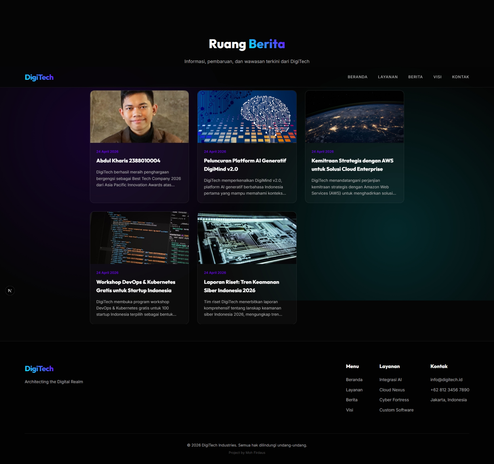
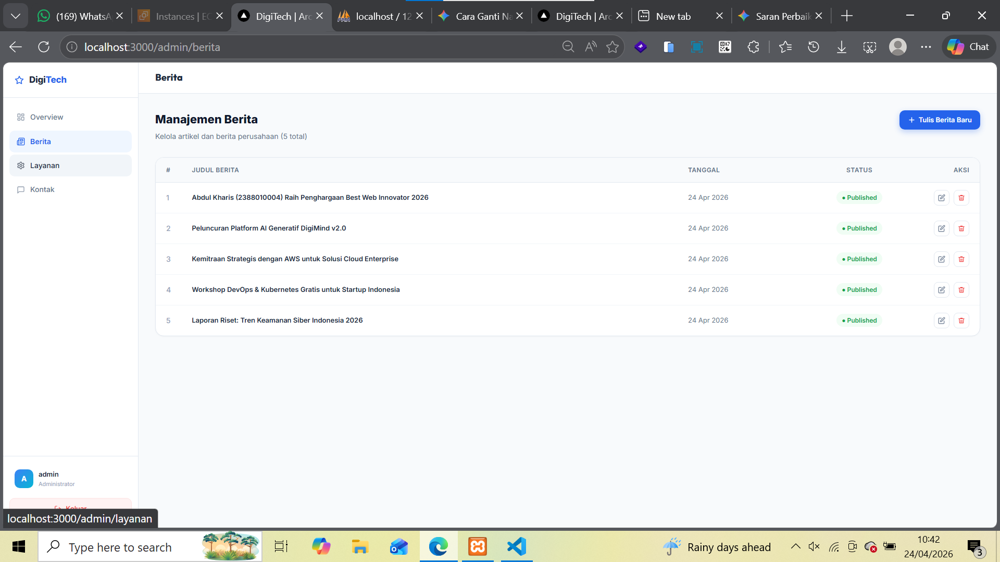
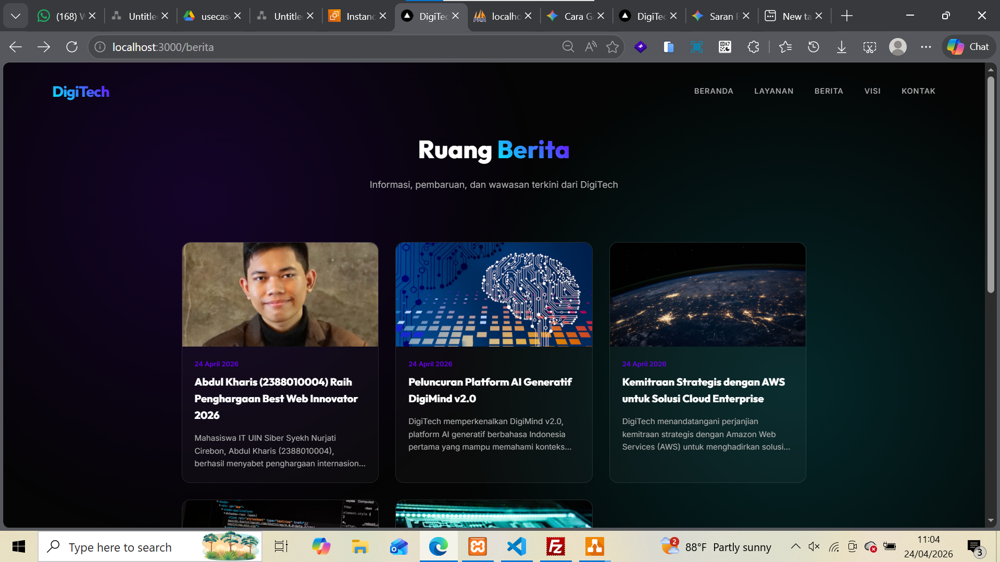

# deploy web apps Framework Next.Js ke AWS

pastikan web apps berjalan di local
-----------------------------------

* instal depedensi npm install
* jalankan web apps npm run dev
* akses web http://localhost:3000

# Deploy Web Apps Framework Next.js ke AWS

1. Pastikan Web Apps berjalan di Local

- install dependensi ->'npm install'
- create db dan import sql
- create file .env dan isi sesuaikan dengagn db local
- jalankan web apps ->'npm run dev'
- akses web apps di browser -> 'http://localhost:3000'
- Testing Front-End pastikan tampilan muncul tanpa error
  
- Testing Back-End -> 'http://localhost:3000/api/berita'

  - user: admin
  - password: admin123
    
- Create static fFIle -> 'npm run build'
- Archive Folder standalone -> ZIP -> klik kanan folder sandalone -> send to -> compressed (zuooed) folder.

  

2. Proses Deploy File ke AWS

- Nyalakan Instance AWS
- Connect Open SSH
- Connect FileZilla
