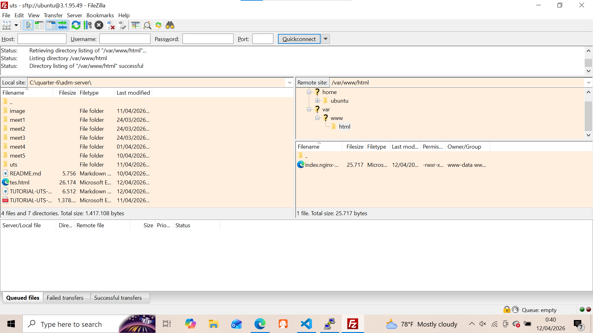
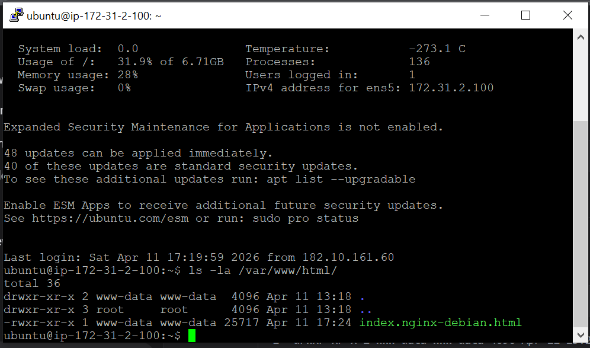
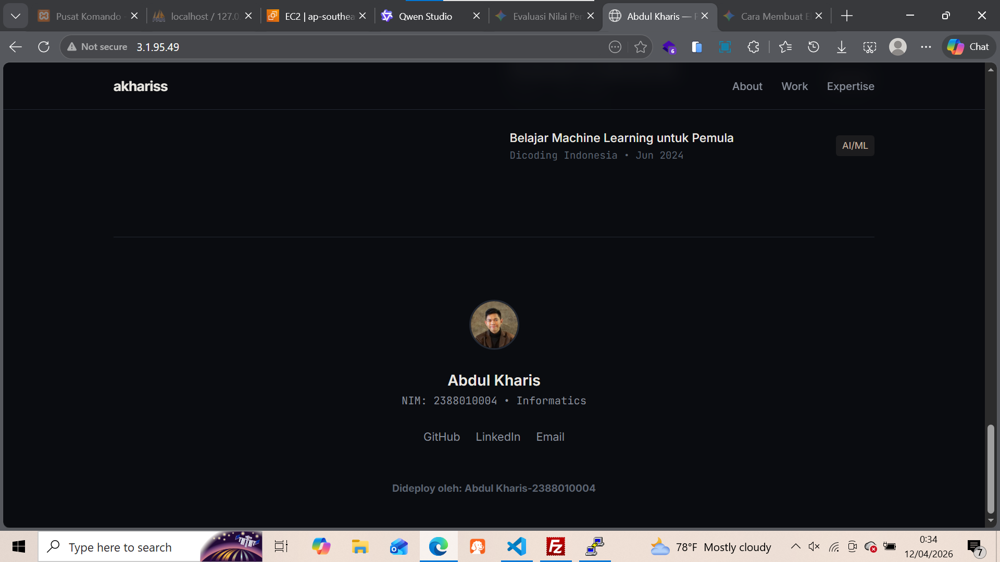
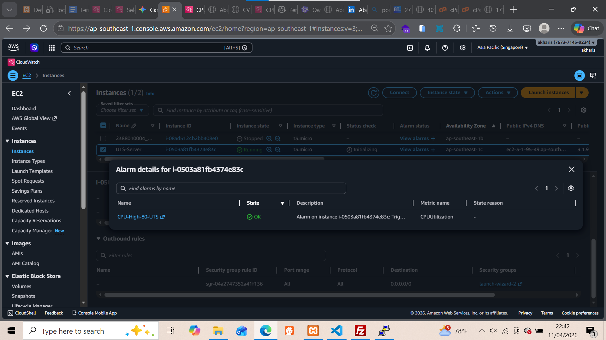

# hecklist Lengkap

### 📦 Yang Harus Disiapkan SEBELUM UTS

- [X] **File website CV/Portfolio** (HTML/CSS/JS static)
  - [X] Ada **foto profil asli** kamu
  - [X] Ada **data diri asli** (nama, pendidikan, skill, dll)
  - [X] Ada **footer** dengan teks: **"Dideploy oleh: [Nama Lengkap] - [NIM]"**
- [X] **AWS Account** sudah aktif
- [X] **PuTTY** sudah terinstall (Windows)
- [X] **FileZilla** sudah terinstall
- [X] **Siapkan text editor** (VS Code, Notepad++, dll) untuk edit footer

### 🎯 Spesifikasi UTS yang Wajib Dipenuhi

#### Infrastructure (EC2)

- [X] Region: **Singapore (ap-southeast-1)**
- [X] AMI: **Ubuntu 22.04 LTS** atau **24.04 LTS**
- [X] Instance Type: **t2.micro** atau **t3.micro** (Free Tier)
- [X] Storage: **8 GB** gp2/gp3
- [X] Login: **Key Pair** (bukan password)
- [X] **Elastic IP** allocated & attached
- [X] Security Group:

  - [X] Port **80** (HTTP) → **0.0.0.0/0** (Anywhere)
  - [X] Port **22** (SSH) → **My IP** saja!

#### Web Server

- [X] **Nginx** installed
- [X] Status: **active (running)** dan **enabled**

<pre class="vditor-reset" placeholder="" contenteditable="true" spellcheck="false">

</pre>

#### Monitoring

- [X] **Detailed CloudWatch Monitoring** enabled (1-minute interval)
- [X] **CPU Alarm >80%** created & status **OK** (hijau)

  

#### Deployment

- [X] Website uploaded via **SFTP** ke `/var/www/html`

  
- [X] Ownership: **www-data:www-data** (bukan ubuntu:ubuntu!)

  Permissions: **755** untuk folder, **644** untuk file

  
- [X] Footer: **"Dideploy oleh: [Nama Lengkap] - [NIM]"**
- [X] Website accessible via `http://<ELASTIC_IP>` tanpa error 403
  

#### 4 Screenshot Wajib (PDF)

- [X] EC2 Console (Instance running + Elastic IP)

  
- [X] Security Group Inbound Rules (Port 22 → My IP)
- [X] CloudWatch Alarms (status OK/hijau)

  
- [X] Terminal: `sudo systemctl status nginx` (active running)

  
