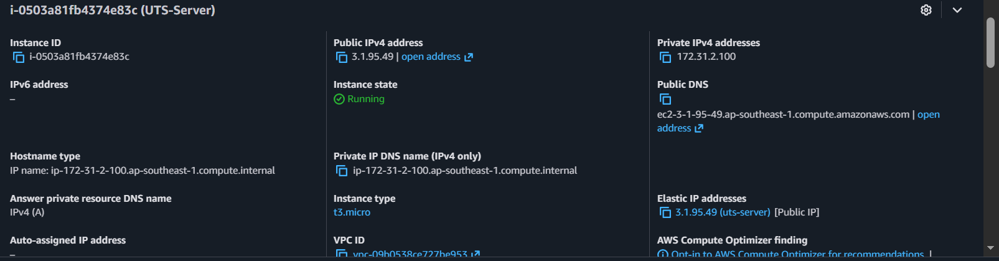
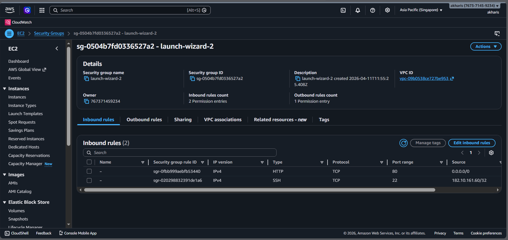
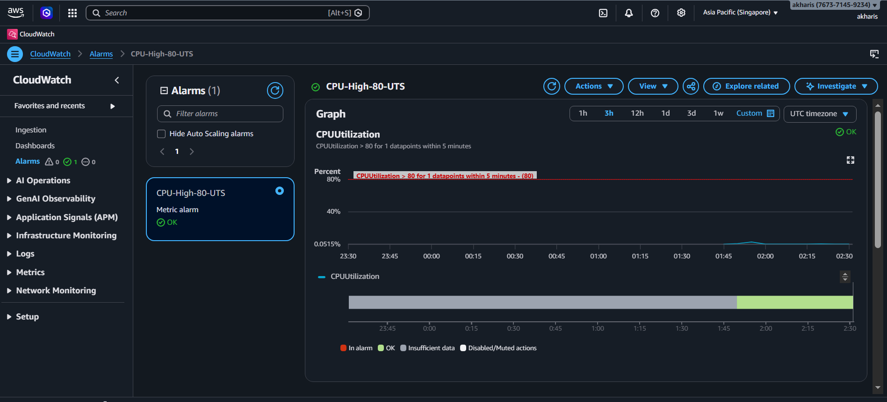
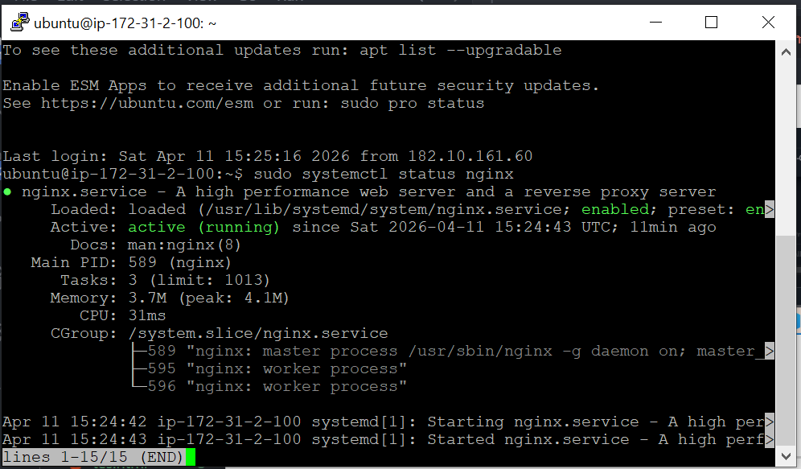

# Screenshot Wajib 

- [X] EC2 Console (Instance running + Elastic IP)

  
- [X] Security Group Inbound Rules (Port 22 → My IP)
- [X] CloudWatch Alarms (status OK/hijau)
  
- [X] Terminal: `sudo systemctl status nginx` (active running)

  
