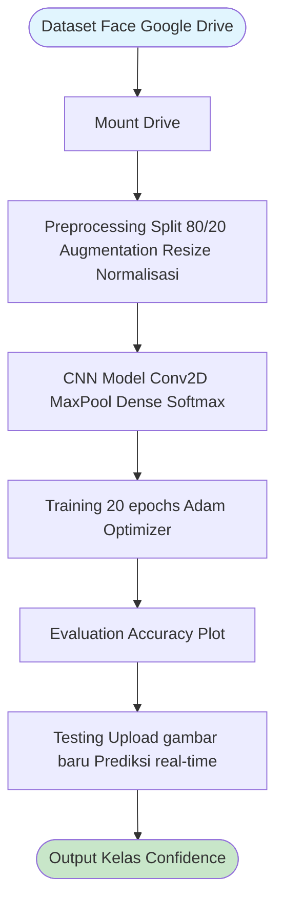

# LEMBAR KERJA MANDIRI 4
## COMPUTER VISION
**T.A. Genap 2025/2026**

**Nilai** | **Paraf Dosen**
--- | ---

## A. Identitas
**Topik**: Project Computer Vision - Face Detection

**Kelompok**: 

**NIM**: [NIM Anggota 1], [NIM Anggota 2], [NIM Anggota 3], [NIM Anggota 4],  
[NIM Anggota 5]

**Nama**: [Nama Anggota 1], [Nama Anggota 2], [Nama Anggota 3], [Nama Anggota 4], [Nama Anggota 5]

**Kelas**: 

## B. Tujuan
1. Mengakses dataset Face Detection
2. Melakukan preprocessing dataset untuk project Face Detection
3. Membuat model klasifikasi wajah

## C. Alur Proses Project Face Detection




*(Gambar di atas merupakan diagram alur proses pembuatan project Face Detection)*

## D. Instruksi Pengerjaan

### Tahap 1 – Mengakses Dataset Face Detection
**a. Screenshot baris sintaks untuk proses Tahap 1**
```python
# Mount Google Drive
from google.colab import drive
drive.mount('/content/drive')

# Path dataset
dataset_path = '/content/drive/MyDrive/Dataset_Face_Only'
print('Dataset accessed at:', dataset_path)
```

**b. Penjelasan setiap baris yang dilakukan di Tahap 1**
- **Baris 1**: Mengimport modul `drive` dari `google.colab` untuk mengakses Google Drive.
- **Baris 2**: Memanggil fungsi `mount()` untuk mount Google Drive ke direktori `/content/drive`.
- **Baris 3**: Menentukan path dataset yang sudah di-crop (hanya wajah) dan di-resize.
- **Baris 4**: Mencetak konfirmasi bahwa dataset berhasil diakses.

**c. Screenshot hasil dari Tahap 1**  
*(Tempatkan screenshot output: Dataset accessed at: /content/drive/MyDrive/Dataset_Face_Only)*

### Tahap 2 – Preprocessing Dataset
**a. Screenshot baris sintaks untuk proses Tahap 2**
```python
import tensorflow as tf
from tensorflow.keras.preprocessing.image import ImageDataGenerator
from sklearn.model_selection import train_test_split
import os

# ImageDataGenerator untuk preprocessing dan augmentation
train_datagen = ImageDataGenerator(
    rescale=1./255,
    rotation_range=20,
    width_shift_range=0.2,
    height_shift_range=0.2,
    horizontal_flip=True,
    validation_split=0.2  # 80% train, 20% val
)

# Load data
train_generator = train_datagen.flow_from_directory(
    dataset_path,
    target_size=(224, 224),
    batch_size=32,
    class_mode='categorical',
    subset='training'
)

val_generator = train_datagen.flow_from_directory(
    dataset_path,
    target_size=(224, 224),
    batch_size=32,
    class_mode='categorical',
    subset='validation'
)

print('Preprocessing selesai. Jumlah kelas:', train_generator.num_classes)
```

**b. Penjelasan setiap baris yang dilakukan di Tahap 2**
- **Baris 1-4**: Import library yang diperlukan untuk preprocessing.
- **Baris 6-14**: Membuat `ImageDataGenerator` untuk normalisasi (rescale), augmentasi data (rotasi, shift, flip), dan split 80/20.
- **Baris 16-22**: Load data training dari direktori dataset.
- **Baris 24-30**: Load data validation.
- **Baris 32**: Cetak konfirmasi preprocessing selesai beserta jumlah kelas.

**c. Screenshot hasil dari Tahap 2**  
*(Tempatkan screenshot output: Found XXX images belonging to Y classes, Preprocessing selesai. Jumlah kelas: Y)*

### Tahap 3 – Membuat Model Klasifikasi Wajah
**a. Screenshot baris sintaks untuk proses Tahap 3**
```python
from tensorflow.keras.models import Sequential
from tensorflow.keras.layers import Conv2D, MaxPooling2D, Flatten, Dense, Dropout

# Buat model CNN
model = Sequential([
    Conv2D(32, (3,3), activation='relu', input_shape=(224, 224, 3)),
    MaxPooling2D(2,2),
    Conv2D(64, (3,3), activation='relu'),
    MaxPooling2D(2,2),
    Conv2D(128, (3,3), activation='relu'),
    MaxPooling2D(2,2),
    Flatten(),
    Dense(512, activation='relu'),
    Dropout(0.5),
    Dense(train_generator.num_classes, activation='softmax')  # Sesuaikan num_classes
])

model.compile(optimizer='adam',
              loss='categorical_crossentropy',
              metrics=['accuracy'])

model.summary()
```

**b. Penjelasan setiap baris yang dilakukan di Tahap 3**
- **Baris 1-2**: Import komponen layer untuk Sequential model.
- **Baris 4-15**: Stack layer CNN: 3 blok Conv2D + MaxPooling, Flatten, Dense, Dropout, output softmax.
- **Baris 17-20**: Compile model dengan optimizer Adam, loss categorical_crossentropy, metrik accuracy.
- **Baris 22**: Tampilkan arsitektur model.

**c. Screenshot hasil dari Tahap 3**  
*(Tempatkan screenshot model.summary())*

### Tahap 4 – Training Model
**a. Screenshot baris sintaks untuk proses Tahap 4**
```python
# Training model
history = model.fit(
    train_generator,
    epochs=20,
    validation_data=val_generator
)

# Simpan model
model.save('/content/drive/MyDrive/face_classification_model.h5')
print('Model berhasil dibuat dan disimpan!')
```

**b. Penjelasan setiap baris yang dilakukan di Tahap 4**
- **Baris 2-6**: Training model selama 20 epoch menggunakan data train dan validasi.
- **Baris 9**: Simpan model yang sudah dilatih ke Google Drive.
- **Baris 10**: Konfirmasi model berhasil disimpan.

**c. Screenshot hasil dari Tahap 4**  
*(Tempatkan screenshot training history: loss/accuracy per epoch)*

### Tahap 5 – Visualisasi Hasil Training
**a. Screenshot baris sintaks untuk proses Tahap 5**
```python
# Plot hasil training
import matplotlib.pyplot as plt

plt.plot(history.history['accuracy'], label='Train Accuracy')
plt.plot(history.history['val_accuracy'], label='Val Accuracy')
plt.legend()
plt.show()
```

**b. Penjelasan setiap baris yang dilakukan di Tahap 5**
- **Baris 2**: Import matplotlib untuk plotting.
- **Baris 4-6**: Plot kurva accuracy training vs validation.
- **Baris 7**: Tampilkan plot.

**c. Screenshot hasil dari Tahap 5**  
*(Tempatkan screenshot plot accuracy curves)*

---

*Lembar Kerja Mandiri: Computer Vision*

